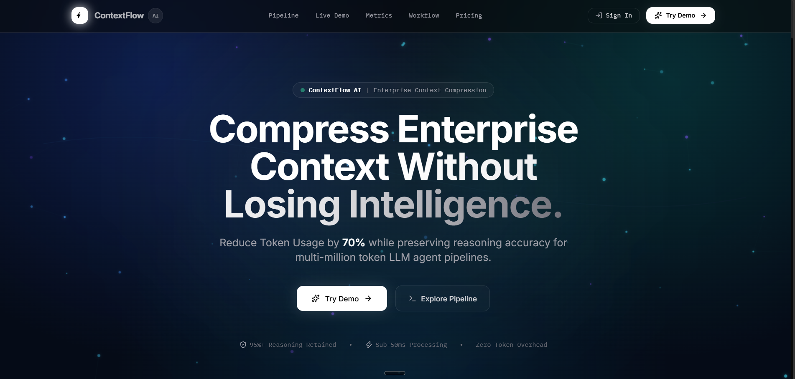
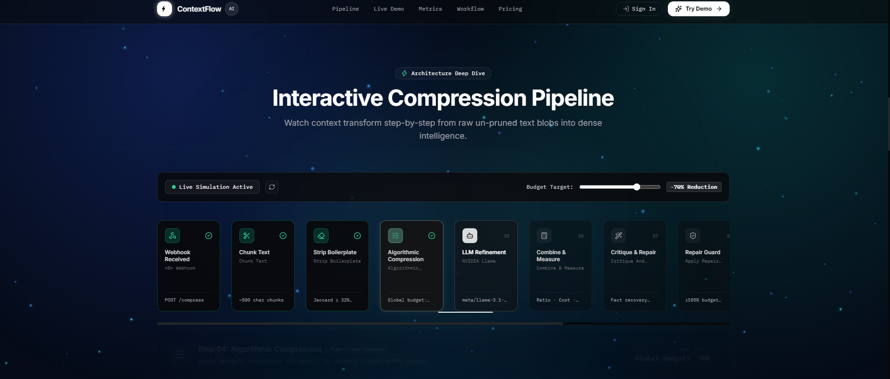
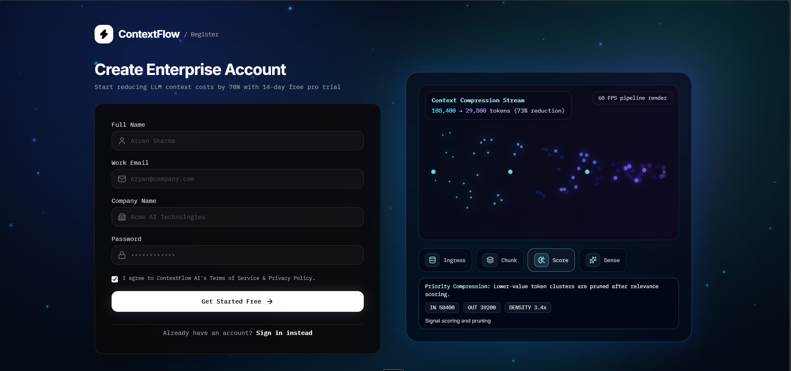
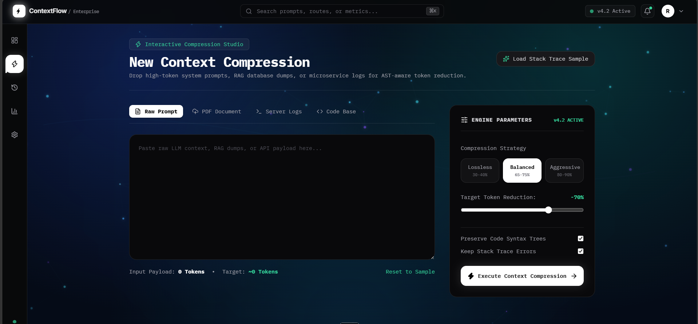
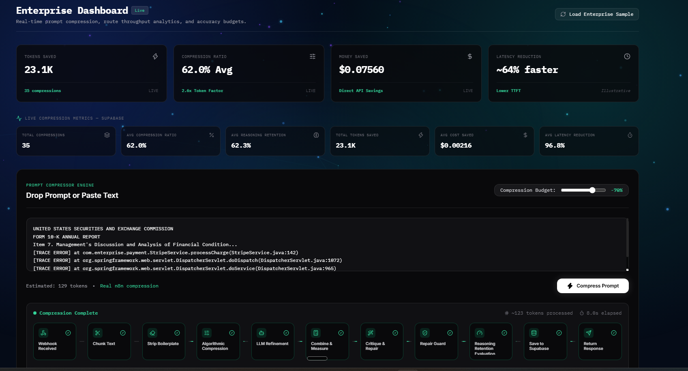
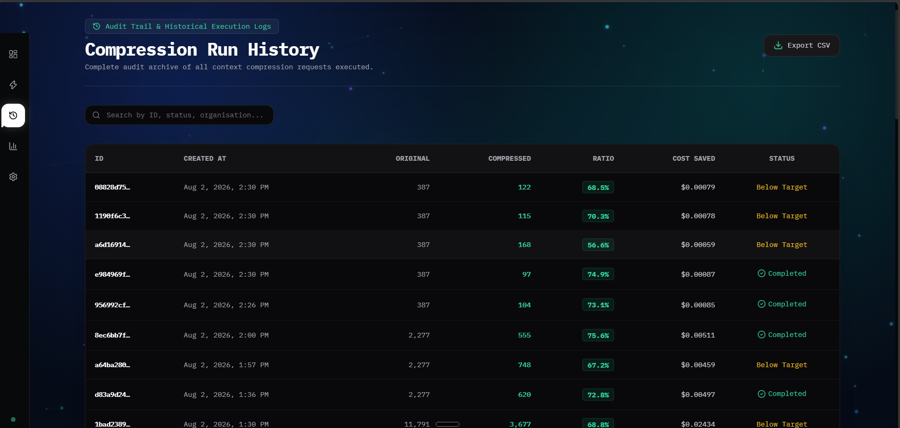
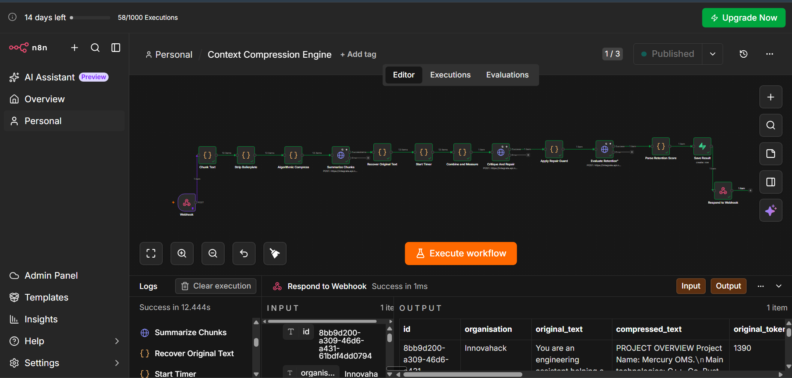
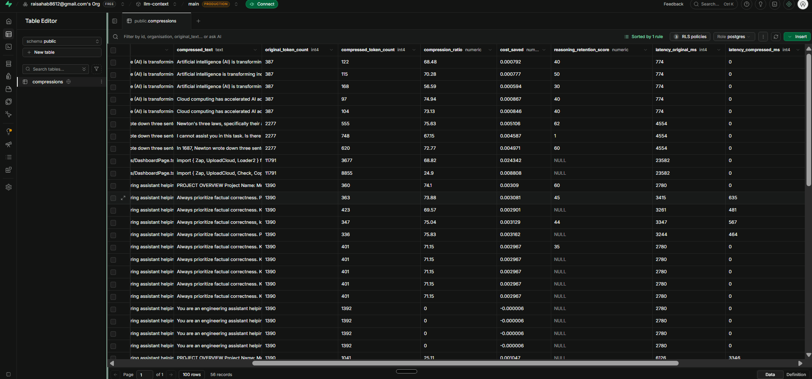

# ⚡ ContextFlow AI

**Ultra-Low Resource LLM Context Compression Engine** — compress enterprise prompts by 70%+ without losing the reasoning that makes them useful.


---

## The Problem

Feeding an LLM 10–20 pages of codebase, logs, or documents on every call is slow and expensive, and most of that context is redundant boilerplate the model doesn't actually need to reason correctly. ContextFlow AI sits in front of that prompt as an algorithmic pre-processing layer: it strips and re-ranks the input down to its highest-value content, cuts it by 70%+, and measures — not assumes — how much of the original reasoning capability survives the compression.

## What It Does

- 📉 **Compresses prompts by 70%+** using a deterministic, LLM-independent scoring algorithm — the ratio is guaranteed by code, not by hoping an LLM follows a length instruction
- 🧹 **Strips redundancy algorithmically** — decorative dividers, conversational filler, and both verbatim *and* semantically-paraphrased duplicate sentences are removed before any LLM is involved
- 🧠 **Refines with an LLM pass** that tightens wording further without ever being allowed to regress below the algorithmic floor
- 🩹 **Runs a critique-and-repair pass** that checks the compressed draft against the original for missing facts and patches them back in, guarded so it can never blow the compression budget
- 📊 **Scores its own output** with an LLM-as-judge that extracts a checklist of key facts from the original and grades the compressed text on recall against it — not a single vague guess
- ⏱️ **Tracks real evaluation metrics per run** — compression ratio, cost saved, reasoning retention, and latency — written to Postgres and shown live, not simulated
- 🔐 **Full auth + persistence** — Supabase email/password auth, protected dashboard routes, per-user compression history

## Architecture

The pipeline is a Vite/React SPA that calls a webhook-triggered n8n workflow, which runs the compression pipeline and writes results to Supabase. The frontend then reads that same table live.

1. **User submits text** on the dashboard or upload page, along with a target compression ratio
2. **n8n Webhook** receives the payload and kicks off the workflow
3. **Chunk Text** — deterministically strips decorative dividers and filler lines, compacts vertical list blocks, then splits the input into ~500-character chunks at sentence-safe boundaries (never mid-word)
4. **Strip Boilerplate** — two-pass dedup: near-literal repeats, then semantic near-duplicates (number/unit-normalized content-word similarity), so three different phrasings of the same fact collapse to one
5. **Algorithmic Compress** — the core token pre-processor. Scores every fragment across the *entire document* for information density (numbers, proper nouns, technical terms, code, label-style facts, header-adjacent definitions) and greedily fills a global token budget with the highest-value content — this alone guarantees the ratio, independent of any LLM
6. **Summarize Chunks (NVIDIA NIM)** — an LLM pass that tightens the already-compressed text further; its output is only accepted if it's no longer than the algorithmic result, so it can only help, never hurt the ratio
7. **Recover Original Text** — reassembles chunks, carrying the true original text/token count through for accurate measurement
8. **Combine and Measure** — computes final token counts, compression ratio, and cost saved
9. **Critique and Repair (NVIDIA NIM)** — checks the compressed draft against the original for missing critical facts and patches them in, guarded so a repair is only accepted if it doesn't grow the token count beyond budget
10. **Evaluate Retention (NVIDIA NIM, LLM-as-judge)** — extracts a checklist of key facts from the original, scores the compressed text's recall against that checklist
11. **Parse Retention Score** → **Save Result** — the full evaluation record is written to Supabase
12. **Respond to Webhook** — the frontend receives the result and renders it live; the dashboard's KPI cards query Supabase directly for aggregate stats across all runs

```mermaid
graph LR
    A[User Input] --> B[n8n Webhook]
    B --> C[Chunk Text<br/>sentence-safe splitting]
    C --> D[Strip Boilerplate<br/>literal + semantic dedup]
    D --> E[Algorithmic Compress<br/>global budget selection]
    E --> F[Summarize Chunks<br/>NVIDIA NIM refinement]
    F --> G[Recover Original Text]
    G --> H[Combine and Measure<br/>ratio + cost]
    H --> I[Critique and Repair<br/>NVIDIA NIM, guarded]
    I --> J[Evaluate Retention<br/>NVIDIA NIM, LLM-as-judge]
    J --> K[Save Result]
    K --> L[(Supabase / Postgres)]
    L --> M[Live Dashboard]
```



> The LLM steps run on **NVIDIA NIM** (`meta/llama-3.1-8b-instruct`) via `integrate.api.nvidia.com`. The pipeline was originally built against Groq (`llama-3.3-70b-versatile`) and migrated after Groq's rate limits were exhausted during heavy testing — the HTTP call shape is OpenAI-compatible, so swapping the endpoint/model is a one-line change in the n8n node.

## Evaluation Metrics

Every compression run writes these to `public.compressions` in Supabase and surfaces them live on the dashboard:

| Metric | Column | What It Measures |
|---|---|---|
| **Compression Ratio** | `compression_ratio` | `(original_token_count − compressed_token_count) / original_token_count`. How much smaller the compressed prompt is than the original — the primary target metric (≥70%). |
| **Cost Reduction** | `cost_saved` | Estimated USD saved per request from sending fewer tokens to a downstream LLM, computed from the token delta at a fixed per-million-token rate. |
| **Reasoning Retention** | `reasoning_retention_score` | An LLM judge extracts a checklist of key facts/numbers/names from the *original* text, then scores what fraction is still present or inferable in the *compressed* text — a recall score, not a vibe-based guess. |
| **Latency Speedup** | `latency_original_ms` / `latency_compressed_ms` | Estimated processing time for the original payload vs. actual measured time for the compressed pipeline run, showing the throughput benefit of sending less text downstream. |

Real-time and historical values for all four metrics are visible on the **Enterprise Dashboard** and **Compression Run History** pages — see live dashboard for current numbers rather than any number quoted here.

## Tech Stack

| Layer | Technology | Purpose |
|---|---|---|
| Frontend framework | React 19 + TypeScript | Component-based SPA |
| Build tooling | Vite 8 | Dev server + production bundling |
| Styling | Tailwind CSS 3 | Utility-first styling |
| Routing | React Router 7 | Client-side routing, protected dashboard routes |
| Animation | Framer Motion | Page transitions, particle effects, motion UI |
| Charts | Recharts | Dashboard analytics visualizations |
| Icons | Lucide React | Icon set |
| Backend / DB | Supabase (Postgres) | Auth, row-level-secured `compressions` table, live queries |
| Workflow automation | n8n (Cloud) | Webhook-triggered compression pipeline orchestration |
| LLM inference | NVIDIA NIM (`meta/llama-3.1-8b-instruct`) | Refinement pass, critique-and-repair, retention judging |
| Deployment | Vercel | Frontend hosting |
| Linting | oxlint | Fast Rust-based linter |

## Screenshots

<!-- Screenshots captured from the live app and n8n workflow, stored in /screenshots -->

**Landing Page**


**Interactive Pipeline Visualization** — landing page walkthrough of the real 11-stage compression pipeline


**Sign Up**


**Upload / Compression Studio**


**Enterprise Dashboard** — live KPIs pulled directly from Supabase, plus the real n8n pipeline running end-to-end


**Compression Run History** — full audit trail of every request


**n8n Workflow Editor** — the actual compression pipeline, node by node


**Supabase Table** — every evaluation metric, per run, live


## Getting Started

### Prerequisites
- Node.js 18+ and npm
- A Supabase project (for auth + the `compressions` table)
- Access to the n8n workflow's webhook URL (see [Architecture](#architecture) — you'll need your own n8n instance with the pipeline described above, or point `VITE_N8N_WEBHOOK_URL` at an existing deployment)

### Installation

```bash
git clone https://github.com/Code456123/llm-context-compressor.git
cd llm-context-compressor
npm install
```

### Configure environment variables

Create a `.env` file in the project root:

```bash
VITE_SUPABASE_URL=https://your-project-ref.supabase.co
VITE_SUPABASE_ANON_KEY=your-supabase-anon-key
VITE_N8N_WEBHOOK_URL=https://your-n8n-instance.app.n8n.cloud/webhook/compress
```

### Run locally

```bash
npm run dev
```

The app runs on Vite's default dev server port. Other available scripts:

```bash
npm run build     # type-check + production build
npm run preview   # preview the production build locally
npm run lint      # run oxlint
```

## Environment Variables

| Variable | Required | Purpose |
|---|---|---|
| `VITE_SUPABASE_URL` | Yes | Your Supabase project URL — used for auth and querying the `compressions` table. |
| `VITE_SUPABASE_ANON_KEY` | Yes | Supabase anon/public API key. Safe for client-side use; actual access is governed by Row Level Security policies on the `compressions` table. |
| `VITE_N8N_WEBHOOK_URL` | Yes | The production webhook URL of your n8n "Context Compression Engine" workflow — this is what the dashboard/upload pages POST text to for compression. |

Only variables prefixed `VITE_` are bundled into the frontend build; anything else in `.env` (e.g. credentials used only for local debugging or CI) is never shipped to the browser.

## Live Demo

🔗 **[https://llm-context-compressor.vercel.app/]**


## Built For

**Innovahack 2026** — Domain 3: Gen AI — Problem Statement 2: *Ultra-Low Resource LLM Context Compression Engine*

**Core requirements:**

- [x] Build an algorithmic token pre-processor that strips semantic redundancy from prompt windows — see `Strip Boilerplate` and `Algorithmic Compress` in the [pipeline](#architecture)
- [x] Condense prompt size by over 70% before passing it to the target model — verified deterministic and consistent across real prose and code test documents; see live dashboard for current per-run figures
- [ ] Retain 95%+ of original downstream answer accuracy — currently in progress. The evaluation methodology (checklist-based LLM-as-judge, replacing an earlier single-guess scorer) and the compression algorithm (global document-wide budget allocation, header-aware fact scoring, critique-and-repair pass) are both actively being iterated on to close this gap; current measured retention is meaningfully below target and tracked transparently in the Supabase `reasoning_retention_score` column rather than asserted here

**Evaluation metrics implemented:** compression ratio, cost reduction, reasoning retention, inference latency — all four computed per-request and persisted, not simulated.
